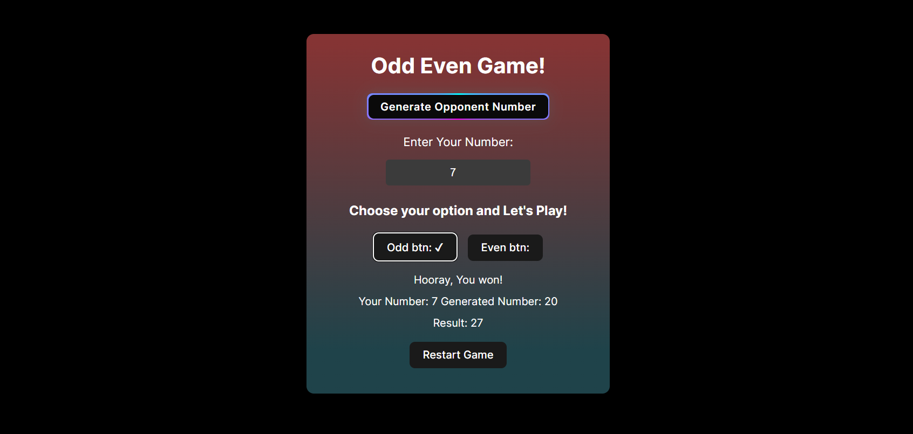

# Odd-Even-Game : A simple React game to test your luck — choose Odd or Even and see if you win!
React frontend project for fun

### 🚀 Live Preview

**[Open Odd Even Game on Netlify](https://coruscating-lebkuchen-df9bf9.netlify.app/)**

## Features

- **Random Opponent Number Generation:**  
  Generate a random number between 0 and 99 to play against.

- **User Number Input:**  
  Enter your own number to add to the opponent’s number.

- **Odd or Even Choice:**  
  Choose whether you think the sum will be odd or even.

- **Instant Win/Lose Feedback:**  
  Displays a message instantly showing if you won or lost based on your choice.

- **Result Display:**  
  Shows the numbers involved and the sum result clearly.

- **Restart Game:**  
  Reset all inputs and messages to play again easily.

- **Simple and Interactive UI:**  
  User-friendly buttons and clear instructions make the game easy to play.
